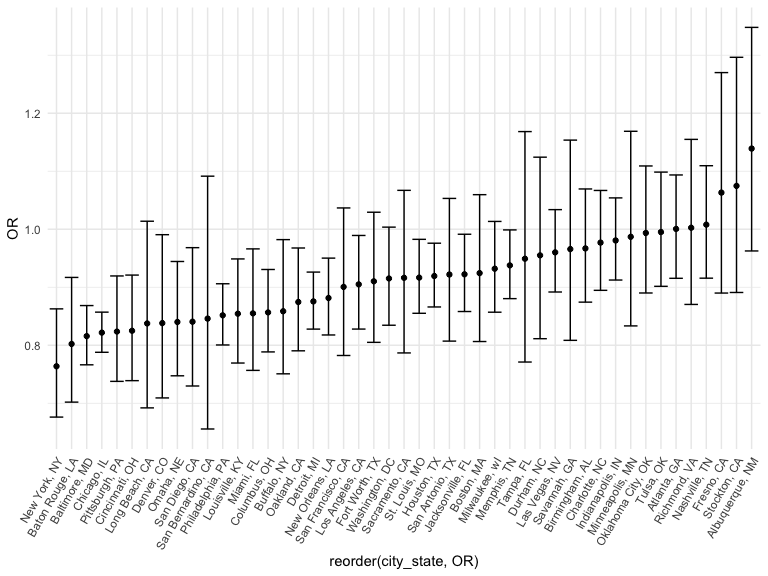
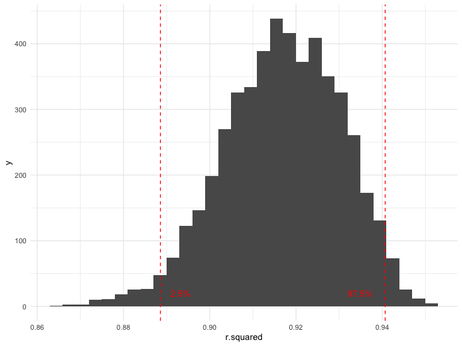
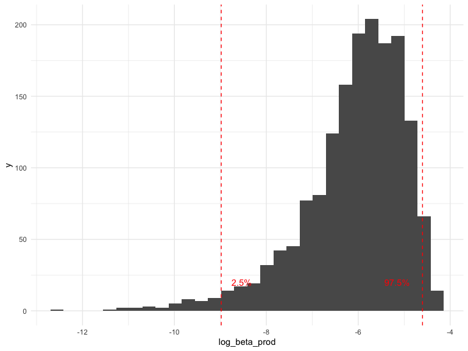

p8105_hw6_khs2318
================
Kayla Schiffer-Kane
2023-12-02

- [Problem 1](#problem-1)
  - [Import and Clean Homicide Data](#import-and-clean-homicide-data)
  - [GLM Baltimore](#glm-baltimore)
  - [City-wise GLM](#city-wise-glm)
  - [Plot OR and CIs](#plot-or-and-cis)
- [Problem 2](#problem-2)

# Problem 1

The *Washington Post* has gathered data on homicides in 50 large U.S.
cities and made the data available through a GitHub repository
[here](https://github.com/washingtonpost/data-homicides). You can read
their accompanying article
[here](https://www.washingtonpost.com/graphics/2018/investigations/where-murders-go-unsolved/).

## Import and Clean Homicide Data

- Create a `city_state` variable (e.g. “Baltimore, MD”)
- Create a binary variable indicating whether the homicide is solved
- Omit cities Dallas, TX; Phoenix, AZ; and Kansas City, MO – these don’t
  report victim race.
- Also omit Tulsa, AL – this is a data entry mistake.
- Limit your analysis those for whom `victim_race` is `white` or
  `black`. Be sure that `victim_age` is numeric.

``` r
homicide_data = read_csv('./data/homicide-data.csv') |>
  janitor::clean_names() |>
  mutate(city_state = paste(city,state, sep = ", "),
         solved = as.numeric(disposition == "Closed by arrest"),
         victim_age = as.numeric(victim_age)) |>
  filter(victim_race %in% c("White","Black")) |>
  filter(!city_state %in% 
           c("Dallas, TX","Phoenix, AZ","Kansas City, MO","Tulsa, AL")) |>
  mutate(victim_race = fct_relevel(victim_race),
         victim_sex = fct_relevel(victim_sex, "Female"))
```

## GLM Baltimore

For the city of Baltimore, MD, use the `glm` function to fit a logistic
regression with resolved vs unresolved as the outcome and victim age,
sex and race as predictors. Save the output of `glm` as an R object;
apply the `broom::tidy` to this object; and obtain the estimate and
confidence interval of the adjusted **odds ratio** for solving homicides
comparing male victims to female victims keeping all other variables
fixed.

``` r
baltimore_logistic = homicide_data |> 
  filter(city_state == "Baltimore, MD") |>
  glm(solved ~ victim_age + victim_sex + victim_race, data = _, family = binomial()) 

baltimore_logistic |>
  broom::tidy(conf.int = TRUE) |>
  mutate(OR = exp(estimate)) |>
  select(term, log_OR = estimate, OR, p.value, conf.low, conf.high) |> 
  knitr::kable(digits = 3)
```

| term             | log_OR |    OR | p.value | conf.low | conf.high |
|:-----------------|-------:|------:|--------:|---------:|----------:|
| (Intercept)      |  0.310 | 1.363 |   0.070 |   -0.025 |     0.648 |
| victim_age       | -0.007 | 0.993 |   0.043 |   -0.013 |     0.000 |
| victim_sexMale   | -0.854 | 0.426 |   0.000 |   -1.126 |    -0.584 |
| victim_raceWhite |  0.842 | 2.320 |   0.000 |    0.501 |     1.187 |

Homicides with male victims are less likely to be solved than those with
female victims.

## City-wise GLM

Now run `glm` for each of the cities in your dataset, and extract the
adjusted odds ratio (and CI) for solving homicides comparing male
victims to female victims. Do this within a “tidy” pipeline, making use
of `purrr::map`, list columns, and `unnest` as necessary to create a
dataframe with estimated ORs and CIs for each city.

``` r
city_logistic = homicide_data |>
  nest(data = -city_state) |>
  mutate(glm = map(data, \(data) glm(solved ~ victim_sex + victim_race + victim_age,  
                                     data = data) |>
                     broom::tidy(conf.int=TRUE, exp = TRUE))) |>
  unnest(glm) |>
  mutate(OR = estimate) |>
  select(city_state, term, OR, p.value, conf.low, conf.high) |>
  filter(term %in% c("victim_sex","victim_sexMale","victim_sexFemale"))

city_logistic |>
  knitr::kable()
```

| city_state         | term           |        OR |   p.value |  conf.low | conf.high |
|:-------------------|:---------------|----------:|----------:|----------:|----------:|
| Albuquerque, NM    | victim_sexMale | 1.1390712 | 0.1314781 | 0.9625464 | 1.3479694 |
| Atlanta, GA        | victim_sexMale | 1.0005193 | 0.9908724 | 0.9153934 | 1.0935614 |
| Baltimore, MD      | victim_sexMale | 0.8157365 | 0.0000000 | 0.7662616 | 0.8684057 |
| Baton Rouge, LA    | victim_sexMale | 0.8022543 | 0.0013271 | 0.7019324 | 0.9169143 |
| Birmingham, AL     | victim_sexMale | 0.9669546 | 0.5133899 | 0.8743020 | 1.0694259 |
| Boston, MA         | victim_sexMale | 0.9243657 | 0.2594040 | 0.8064070 | 1.0595790 |
| Buffalo, NY        | victim_sexMale | 0.8586506 | 0.0266457 | 0.7507275 | 0.9820886 |
| Charlotte, NC      | victim_sexMale | 0.9769660 | 0.6039922 | 0.8946579 | 1.0668465 |
| Chicago, IL        | victim_sexMale | 0.8217273 | 0.0000000 | 0.7878555 | 0.8570552 |
| Cincinnati, OH     | victim_sexMale | 0.8249529 | 0.0006495 | 0.7389595 | 0.9209534 |
| Columbus, OH       | victim_sexMale | 0.8566020 | 0.0002636 | 0.7884917 | 0.9305956 |
| Denver, CO         | victim_sexMale | 0.8381536 | 0.0396375 | 0.7091705 | 0.9905959 |
| Detroit, MI        | victim_sexMale | 0.8755806 | 0.0000036 | 0.8278085 | 0.9261096 |
| Durham, NC         | victim_sexMale | 0.9550185 | 0.5807926 | 0.8112823 | 1.1242206 |
| Fort Worth, TX     | victim_sexMale | 0.9102630 | 0.1346385 | 0.8049822 | 1.0293131 |
| Fresno, CA         | victim_sexMale | 1.0631507 | 0.5004335 | 0.8899643 | 1.2700390 |
| Houston, TX        | victim_sexMale | 0.9193087 | 0.0058386 | 0.8659903 | 0.9759099 |
| Indianapolis, IN   | victim_sexMale | 0.9806640 | 0.5958691 | 0.9124109 | 1.0540227 |
| Jacksonville, FL   | victim_sexMale | 0.9223401 | 0.0283084 | 0.8581298 | 0.9913550 |
| Las Vegas, NV      | victim_sexMale | 0.9601634 | 0.2811234 | 0.8917830 | 1.0337871 |
| Long Beach, CA     | victim_sexMale | 0.8375926 | 0.0705089 | 0.6920139 | 1.0137967 |
| Los Angeles, CA    | victim_sexMale | 0.9049770 | 0.0281853 | 0.8278785 | 0.9892554 |
| Louisville, KY     | victim_sexMale | 0.8543645 | 0.0033942 | 0.7693283 | 0.9487999 |
| Memphis, TN        | victim_sexMale | 0.9377110 | 0.0460370 | 0.8803460 | 0.9988140 |
| Miami, FL          | victim_sexMale | 0.8549934 | 0.0123405 | 0.7566545 | 0.9661129 |
| Milwaukee, wI      | victim_sexMale | 0.9319241 | 0.0996980 | 0.8569625 | 1.0134428 |
| Minneapolis, MN    | victim_sexMale | 0.9869343 | 0.8789956 | 0.8333335 | 1.1688468 |
| Nashville, TN      | victim_sexMale | 1.0079105 | 0.8722794 | 0.9156245 | 1.1094980 |
| New Orleans, LA    | victim_sexMale | 0.8814679 | 0.0010145 | 0.8177140 | 0.9501924 |
| New York, NY       | victim_sexMale | 0.7637459 | 0.0000183 | 0.6761331 | 0.8627114 |
| Oakland, CA        | victim_sexMale | 0.8745391 | 0.0095911 | 0.7903881 | 0.9676495 |
| Oklahoma City, OK  | victim_sexMale | 0.9935634 | 0.9084310 | 0.8900833 | 1.1090740 |
| Omaha, NE          | victim_sexMale | 0.8400995 | 0.0037434 | 0.7473239 | 0.9443925 |
| Philadelphia, PA   | victim_sexMale | 0.8516025 | 0.0000004 | 0.8004703 | 0.9060010 |
| Pittsburgh, PA     | victim_sexMale | 0.8235901 | 0.0005886 | 0.7377210 | 0.9194541 |
| Richmond, VA       | victim_sexMale | 1.0025804 | 0.9715362 | 0.8703483 | 1.1549025 |
| San Antonio, TX    | victim_sexMale | 0.9219496 | 0.2320853 | 0.8071190 | 1.0531175 |
| Sacramento, CA     | victim_sexMale | 0.9162242 | 0.2615604 | 0.7867370 | 1.0670233 |
| Savannah, GA       | victim_sexMale | 0.9657366 | 0.7010863 | 0.8084399 | 1.1536381 |
| San Bernardino, CA | victim_sexMale | 0.8459249 | 0.2001555 | 0.6556212 | 1.0914669 |
| San Diego, CA      | victim_sexMale | 0.8405635 | 0.0167423 | 0.7297372 | 0.9682212 |
| San Francisco, CA  | victim_sexMale | 0.9005776 | 0.1454915 | 0.7823300 | 1.0366982 |
| St. Louis, MO      | victim_sexMale | 0.9166148 | 0.0141616 | 0.8550826 | 0.9825749 |
| Stockton, CA       | victim_sexMale | 1.0747297 | 0.4522380 | 0.8909635 | 1.2963985 |
| Tampa, FL          | victim_sexMale | 0.9491292 | 0.6229995 | 0.7710549 | 1.1683294 |
| Tulsa, OK          | victim_sexMale | 0.9951681 | 0.9234718 | 0.9015676 | 1.0984861 |
| Washington, DC     | victim_sexMale | 0.9151561 | 0.0598747 | 0.8344983 | 1.0036097 |

``` r
city_logistic |>
  group_by(city_state, term, OR) |>
  summarize(ci_lower = quantile(OR, 0.025),
         ci_upper = quantile(OR, 0.975))
```

## Plot OR and CIs

Create a plot that shows the estimated ORs and CIs for each city.
Organize cities according to estimated OR, and comment on the plot.

``` r
city_logistic |>
  ggplot(aes(x = reorder(city_state, OR), y = OR)) + geom_point() +
  geom_errorbar(aes(ymin = conf.low, ymax = conf.high)) +
  theme(axis.text.x = element_text(angle = 60, hjust = 1))
```



There are only a few cities, including Albuquerque and Stockholm, where
homocides are more likely to be solved for men than women. In most
cities, the odds ratio are in favor of homicides being solved for female
victims.

# Problem 2

For this problem, we’ll use the Central Park weather data similar to
data we’ve seen elsewhere. The code chunk below (adapted from the course
website) will download these data.

``` r
weather_df = 
  rnoaa::meteo_pull_monitors(
    c("USW00094728"),
    var = c("PRCP", "TMIN", "TMAX"), 
    date_min = "2022-01-01",
    date_max = "2022-12-31") |>
  mutate(
    name = recode(id, USW00094728 = "CentralPark_NY"),
    tmin = tmin / 10,
    tmax = tmax / 10) |>
  select(name, id, everything())
```

The boostrap is helpful when you’d like to perform inference for a
parameter / value / summary that doesn’t have an easy-to-write-down
distribution in the usual repeated sampling framework. We’ll focus on a
simple linear regression with `tmax` as the response with `tmin` and
`prcp` as the predictors, and are interested in the distribution of two
quantities estimated from these data:

- $\hat{r}^2$
- $\log(\hat{\beta}_1 * \hat{\beta}_2)$

Use 5000 bootstrap samples and, for each bootstrap sample, produce
estimates of these two quantities. Plot the distribution of your
estimates, and describe these in words. Using the 5000 bootstrap
estimates, identify the 2.5% and 97.5% quantiles to provide a 95%
confidence interval for $\hat{r}^2$ and
$\log(\hat{\beta}_0 * \hat{\beta}_1)$. Note: `broom::glance()` is
helpful for extracting $\hat{r}^2$ from a fitted regression, and
`broom::tidy()` (with some additional wrangling) should help in
computing $\log(\hat{\beta}_1 * \hat{\beta}_2)$.

**Generate bootstrap samples**

``` r
boot_sample = function(df) {
  sample_frac(df, replace = TRUE)
}

boot_straps = 
  tibble(strap_number = 1:1000) |> 
  mutate(
    strap_sample = map(strap_number, \(i) boot_sample(df = weather_df))
  )

boot_straps
```

    ## # A tibble: 1,000 × 2
    ##    strap_number strap_sample      
    ##           <int> <list>            
    ##  1            1 <tibble [365 × 6]>
    ##  2            2 <tibble [365 × 6]>
    ##  3            3 <tibble [365 × 6]>
    ##  4            4 <tibble [365 × 6]>
    ##  5            5 <tibble [365 × 6]>
    ##  6            6 <tibble [365 × 6]>
    ##  7            7 <tibble [365 × 6]>
    ##  8            8 <tibble [365 × 6]>
    ##  9            9 <tibble [365 × 6]>
    ## 10           10 <tibble [365 × 6]>
    ## # ℹ 990 more rows

**Apply logistic regression to bootstraps and extract desired
estimates**

``` r
bootstrap_results = 
  boot_straps |> 
  mutate(
    models = map(strap_sample, \(df) lm(tmax ~ tmin + prcp, data = df) ),
    results = map(models, broom::tidy)) |> 
  select(-strap_sample, -models) |> 
  unnest(results) 

bootstrap_results 
```

``` r
lm(tmax ~ tmin + prcp, data = weather_df) |>
  broom::glance() |>
  select(r.squared) 

lm(tmax ~ tmin + prcp, data = weather_df) |>
  broom::tidy() |>
  mutate(beta_prod = (estimate[2] * estimate[3])) |>
  mutate(log_beta = log(beta_prod)) |>
  select(log_beta)
```

``` r
bootstrap_lm = 
  boot_straps |> 
  mutate(
    models = map(strap_sample, \(df) lm(tmax ~ tmin + prcp, data = df)))

bootstrap_betas = bootstrap_lm |>
  mutate(results = map(models, broom::tidy)) |> 
  select(-strap_sample, -models) |> 
  unnest(results) |>
  group_by(strap_number) |>
  summarize(beta_prod = estimate[term == "tmin"] * estimate[term == "prcp"]) |>
  mutate(log_beta_prod = log(beta_prod)) |>
  select(-beta_prod)

bootstrap_rsquared = bootstrap_lm |>
  mutate(results = map(models, broom::glance)) |> 
  select(-strap_sample, -models) |> 
  unnest(results) |>
  select(strap_number, r.squared)
```

**Plot estimates**

``` r
bootstrap_rsquared |>
  ggplot(aes(x = r.squared)) + geom_histogram()
```



``` r
bootstrap_betas |>
  ggplot(aes(x = log_beta_prod)) + geom_histogram()
```


